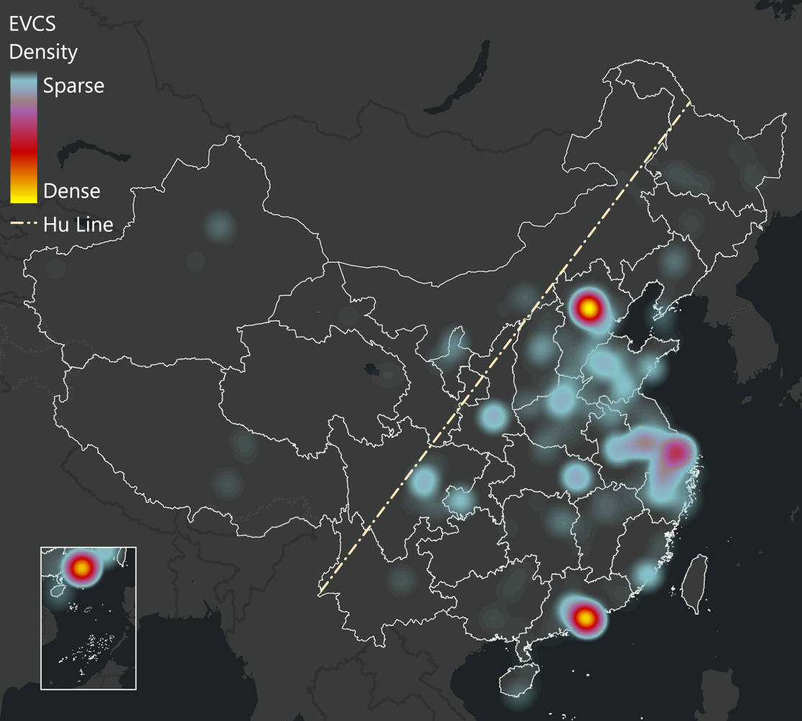
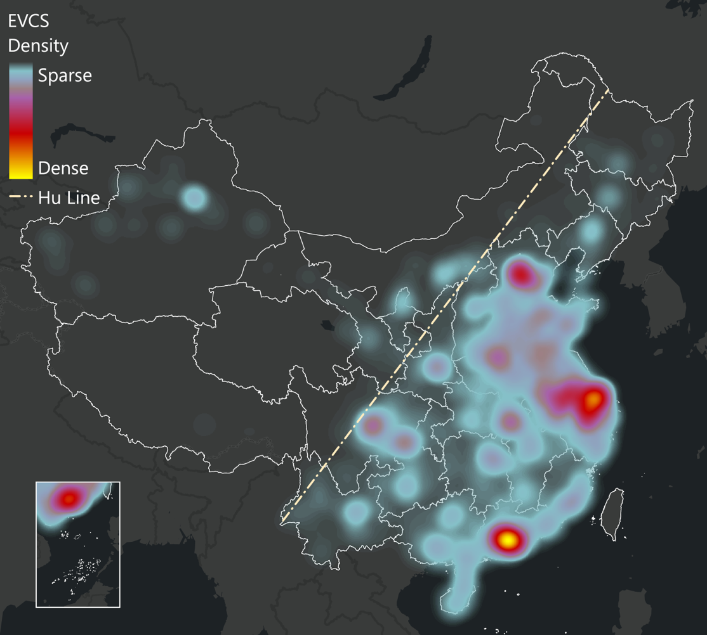

# China Public Electric Vehicle Charging Station (EVCS) Data (2015-2025)

> Posted on 27 November 2025 by Ding CHEN

We are glad to share the China Public Electric Vehicle Charging Station (EVCS) Data from 2015 to 2025, sourced from Amap. Over this 11-year period, the number of stations increased from 1,832 at the end of 2014 to 271,802 stations by the middle of 2025. 
| 2015 | 2025 |
| :--: | :--: |
|  |  |
> *Spatial Kernel Density Distribution of Public Electric Vehicle Charging Stations in China: 2015 (left) vs. 2025 (right).*

You can download the sample data and request the full datasets through our Data Sharing Initiative (see [here](/datasets/ev-charger/China-2015-2025)).
