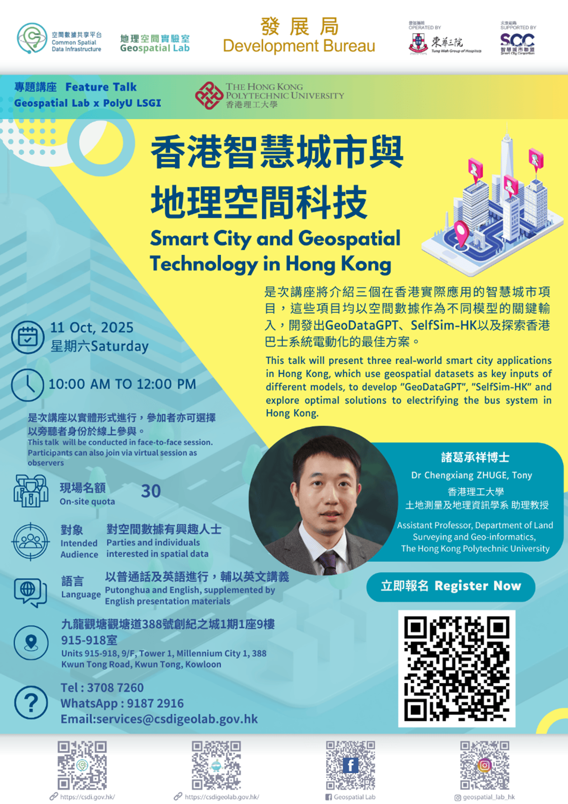
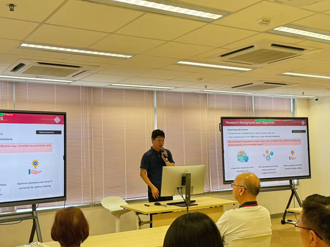

# Research Group Presents at Geospatial Lab Feature Talk

> Posted on 5 November 2025 by Ding CHEN

> *Promotional Poster for Geospatial Lab Feature Talk*

Dr. Zhuge was invited by the Hong Kong Government Development Bureau’s Geospatial Lab for a feature talk on October 11, 2025. Our research group delivered a presentation titled “Smart City and Geospatial Technology in Hong Kong”, highlighting the pivotal role of geospatial data in urban development.
During the session, group member Zili Tian showcased our latest research on Hong Kong’s electric bus system. The presentation focused on exploring optimal solutions for electrifying the city’s bus network, a key step towards achieving zero-emission transportation. Zili demonstrated our data-driven simulation platform and shared findings from a comprehensive feasibility analysis.

> *Zili Tian Presents Electric Bus Research at Geospatial Lab*

This research is supported by the Public Policy Research (PPR) Funding Scheme, administered by the Chief Executive’s Policy Unit (CEPU). The talk attracted a diverse audience from academia and industry, who engaged in thoughtful discussion about the simulation details and its implications for smart city planning.
The event exemplified how big geospatial data can be leveraged for transport planning, supporting Hong Kong’s transition to a smart city and its zero-emission goals.
