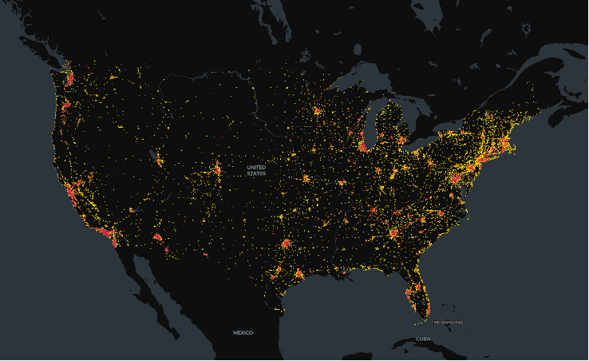

# U.S. Public Electric Vehicle Charging Station (EVCS) Data (2014-2024)

> Posted on 8 November 2025 by Ding CHEN

We are glad to share the U.S. Public Electric Vehicle Charging Station (EVCS) Data from 2014 to 2024, sourced from U.S. Department of Energy’s Alternative Fuel Data Center (AFDC). Over this 11-year period, the number of stations increased from 9,094 stations with 22,217 chargers at the end of 2014 to 69,593 stations with 195,693 chargers by the end of 2024. 

> *U.S. Public Electric Vehicle Charging Station Data in 2014 (red dots) and 2024 (yellow dots)*

<<<<<<< HEAD
You can download the sample data and request the full datasets through our Data Sharing Initiative (see [here](/datasets/ev-charger/US-public-electric-vehicle-charging-station(EVCS)-data-(2014-2024))), or access them from the U.S. Department of Energy’s Alternative Fuel Data Center at: 
=======
You can download the sample data and request the full datasets through our Data Sharing Initiative (see [here](/datasets/ev-charger/USA-2014-2024)), or access them from the U.S. Department of Energy’s Alternative Fuel Data Center at: 
>>>>>>> 16f227c862402691979df5003833ff1439e00667
https://afdc.energy.gov/fuels/electricity-locations#/find/nearest?fuel=ELEC.
