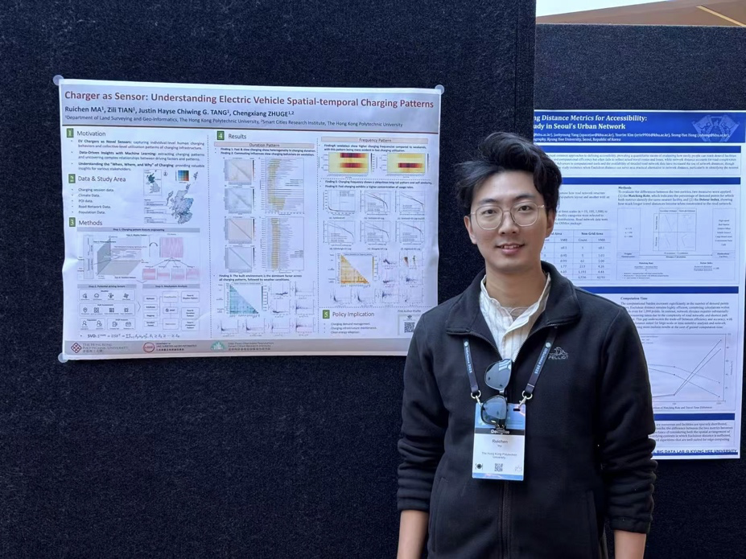
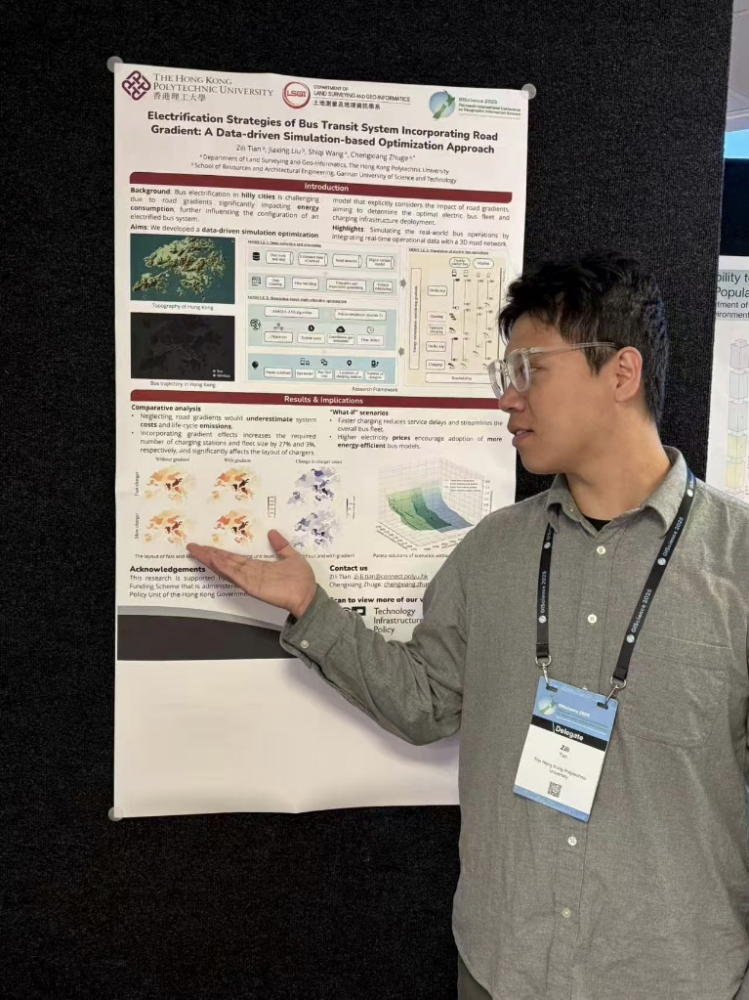

# Conference Poster Presentation at GIScience 2025

> Posted on 11 September 2025 by Zhiqing PAN

We are pleased to announce that our research group members, Ruichen MA and Zili TIAN, from the Global EV Research Group, presented their research work at the 13th International Conference on Geographic Information Science (GIScience 2025), hosted by the University of Canterbury, in Christchurch, New Zealand, in collaboration with the GIScience academic research community across New Zealand.

Ruichen delivered a poster presentation titled “Charger as Sensor: Revealing Electric Vehicle Spatio-temporal Charging Patterns in Scotland”, while Zili presented his research named “Electrification Strategies of Bus Transit System Incorporating Road Gradient: A Data-Driven Simulation-based Optimization Approach”. Both presentations were delivered on 27 August 2025. 

> *Poster Presentation at GIScience 2025 (Ruichen MA)*

> *Poster Presentation at GIScience 2025 (Zili TIAN)*

