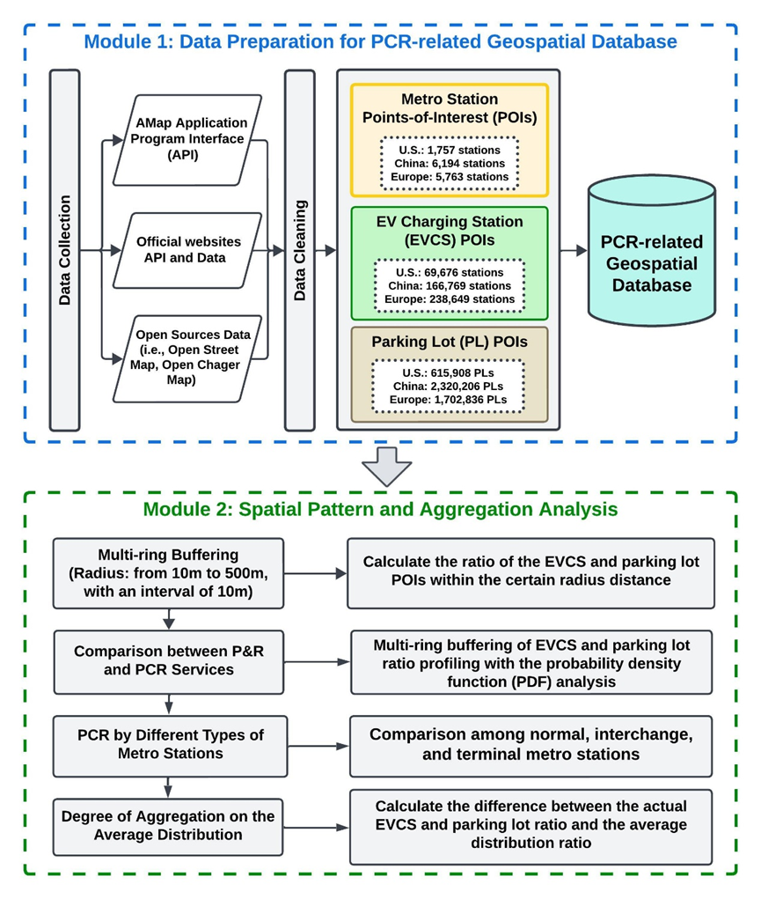
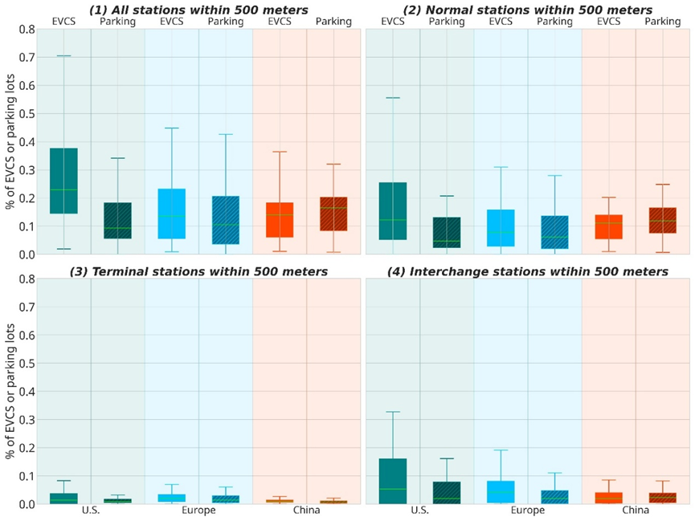

# A Global Insight into Park-Charge-Ride Published in Sustainable Cities and Society

> Posted on 8 February 2026 by Ding CHEN

We are delighted to announce that our research paper titled “A global insight into integration of metro and electric vehicle charging stations” has been published in Sustainable Cities and Society in February 2026! You can access the full paper [here](https://doi.org/10.1016/j.scs.2026.107217) or via its DOI: 10.1016/j.scs.2026.107217.

This study provides one of the first comprehensive, data-driven assessments of the emerging Park-Charge-Ride (PCR) concept across 153 urban areas in the United States, Europe, and China. By analyzing the spatial proximity, density, and clustering patterns of electric vehicle charging stations (EVCS) and parking lots relative to metro stations, we reveal significant regional disparities in the readiness and development of integrated electric mobility hubs:

-	Substantial regional contrasts: The United States shows strong but uneven aggregation of EVCS near metro stations; Europe achieves a more balanced integration of EVCS and parking facilities; while China, despite its extensive metro networks, exhibits limited EVCS integration near transit nodes.

-	No significant link to station type: The distribution of EVCS does not significantly align with metro station types (normal, interchange, or terminal), indicating a missed opportunity for targeted infrastructure planning.

-	Divergence between PCR and P&R development: The U.S. shows stronger development of PCR relative to traditional Park-and-Ride (P&R), whereas China has strong P&R presence but significant potential to upgrade to PCR. Europe maintains parity between the two.

The research underscores that integrating EV charging with transit systems is highly context-dependent and should align strategically with local urban development goals. It provides evidence-based insights to help policymakers, transport planners, and urban developers optimize charging infrastructure placement, enhance multimodal connectivity, and support the global shift toward sustainable electric mobility.

> *Analytical framework of the study*

> *Distribution of EVCS and parking lots by metro station type*
