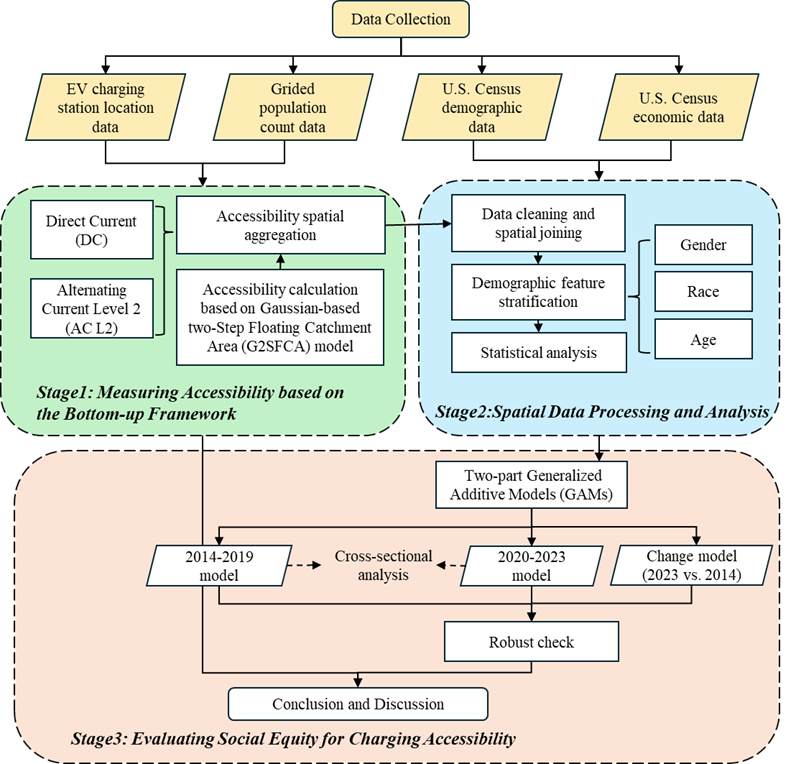
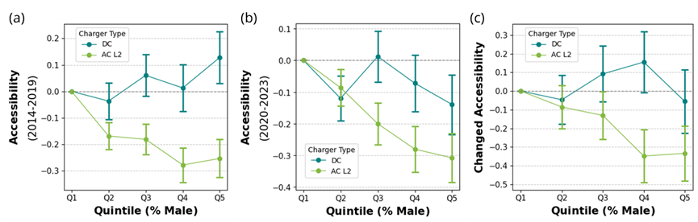

# Dynamic EV Charging Social Disparities in the U.S. Published in Transportation Research Part D

> Posted on 31 March 2026 by Ding CHEN

We are delighted to announce that our research paper titled “Dynamic social disparities in the U.S. electric vehicle charging infrastructure system” has been published in Transportation Research Part D: Transport and Environment in March 2026! You can access the full paper [here](https://doi.org/10.1016/j.trd.2026.105307) or via its DOI: 10.1016/j.trd.2026.105307. 

This study focuses on the evolution of social equity in EV charging from 2014 to 2023, revealing persistent disparities in charger access despite the expansion of infrastructure and shifts in socioeconomic and demographic characteristics.

-	First, counties with higher proportions of males consistently show lower AC L2 charging accessibility throughout the past decade.

-	Second, counties with higher Asian American (AA) populations tend to have lower DC fast charging accessibility, while those with higher Black American (BA) populations exhibit lower AC L2 accessibility across both periods. These disparities may reflect historically unequal charger siting incentives, driven largely by EV adoption rates and household income distributions. 

-	Third, counties with larger AA populations showed lower AC L2 and overall accessibility during 2014–2019 but improved after 2020, with their DC fast charging disadvantage also narrowing. By contrast, counties with larger BA populations face persistently widening accessibility gaps. These diverging trajectories underscore that charging equity is dynamic rather than static.

-	Fourth, counties with more older adults tend to experience higher overall charging accessibility over the past decade. These patterns may relate to the residential distribution of older adults, who are increasingly concentrated in lower-density areas and more likely to live in single-family homes, where competition for public chargers is lower and installation conditions are generally more favorable.

This study reveals long-term changes in EV charging social disparities, and the insights derived from these disparities can help inform more equitable EV charger deployment strategies and support inclusive EV adoption across diverse population groups in the U.S. 

> *Analytical framework for accessing public EV charging accessibility and social equity in the U.S.*

> *Model-estimated associations between male population share and public EV charging accessibility by charger type*
