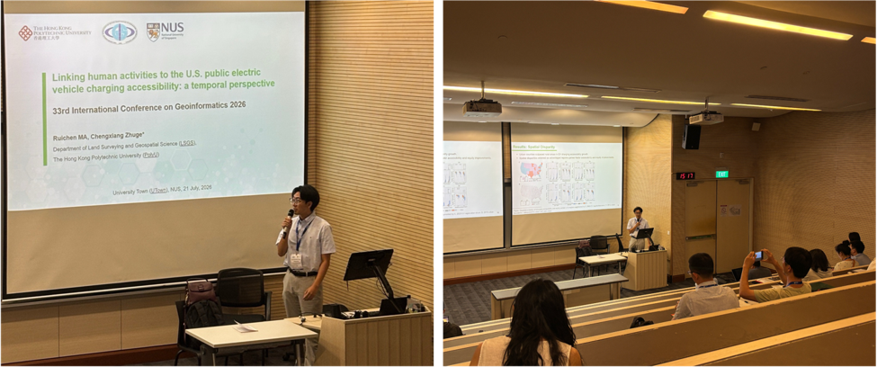

# Presentation on U.S. EV Charging Accessibility at CPGIS 2026

> Posted on 24 July 2026 by Ding Chen

A member of our research group Global EV Data Initiative, Ruichen Ma, presented the latest findings on public electric vehicle (EV) charging accessibility in the United States (U.S.). The presentation was delivered on 21 July at the Stephen Riady Centre, National University of Singapore, as part of the session “Cyberinfrastructure and GeoAI for Intelligent Spatial Decision Support” at the GeoInformatics 2026 conference. (See session details https://geoinformatics2026.github.io/paper-r4882/). The study explores how public EVCS accessibility and equity have evolved in the U.S. from 2014 to 2024, from both residential and activity-based perspectives.

> *Ruichen MA Presents U.S. EV Charging Accessibility Study at National University of Singapore*