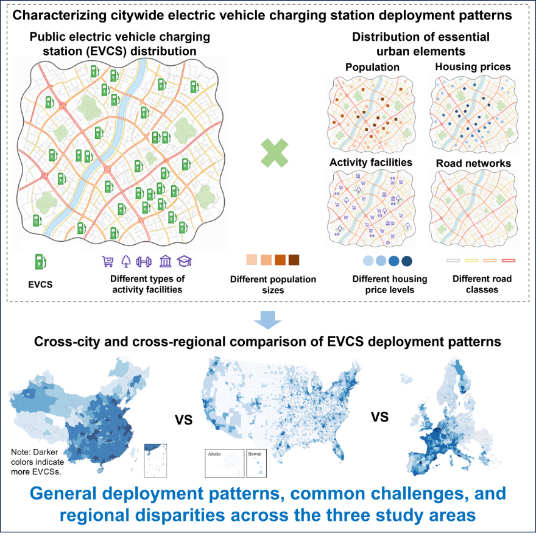
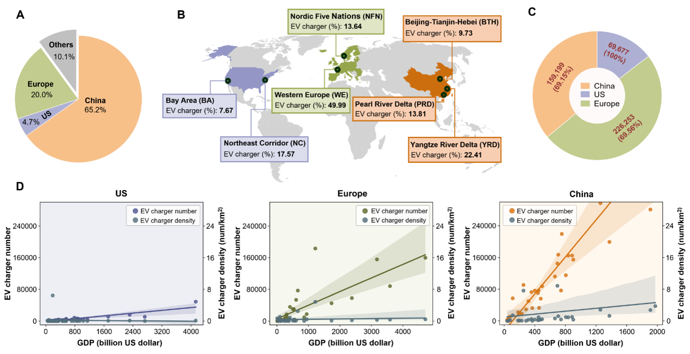

# A Spatial Planning Perspective on the Global Deployment of Public Electric Vehicle Charging Stations

> Posted on 26 July 2026 by Ding Chen

We are delighted to announce that our research paper titled “A Spatial Planning Perspective on the Global Deployment of Public Electric Vehicle Charging Stations” has been published in Cell Reports Sustainability in July 2026. You can access the full paper [here](https://www.cell.com/cell-reports-sustainability/fulltext/S2949-7906(26)00155-2) or via its DOI: https://doi.org/10.1016/j.crsus.2026.100786.

Our study assesses global relationships between public electric vehicle charging station (EVCS) deployment and key urban elements, including population, housing prices, activity facilities and road networks, using an open-access 2024 dataset of more than 450,000 EVCSs worldwide. Comparing cities across China, the United States (US) and Europe reveals shared challenges and pronounced regional disparities in EVCS siting and accessibility, highlighting potential equity concerns.

- First, across all the three study areas, charging facilities are more heavily concentrated in economically developed city clusters, while less-developed regions remain comparatively underserved.
- Second, in most cities in China and the US, EVCSs are more inclined to be located in relatively low-density areas and areas with housing prices close to the city average. By contrast, EVCS deployment in European cities exhibits a weaker density bias, with EVCSs distributed across a broader within-city population-density gradient.
- Third, EVCSs tend to be deployed in areas with more diverse amenities in US and European cities than in Chinese cities.
- Fourth, compared with China and Europe, US cities tend to concentrate EVCSs in areas with higher road-network density.

This study offers new insights into global accessibility and equity in EVCS deployment, providing policy-relevant guidance for more sustainable and equitable infrastructure planning, cross-regional learning, and knowledge-driven urban electrification.

> *Analytical framework for cross-city and cross-region comparison of EVCS deployment patterns*

> *Overview of global EVCSs: geographical locations and statistical distributions*
