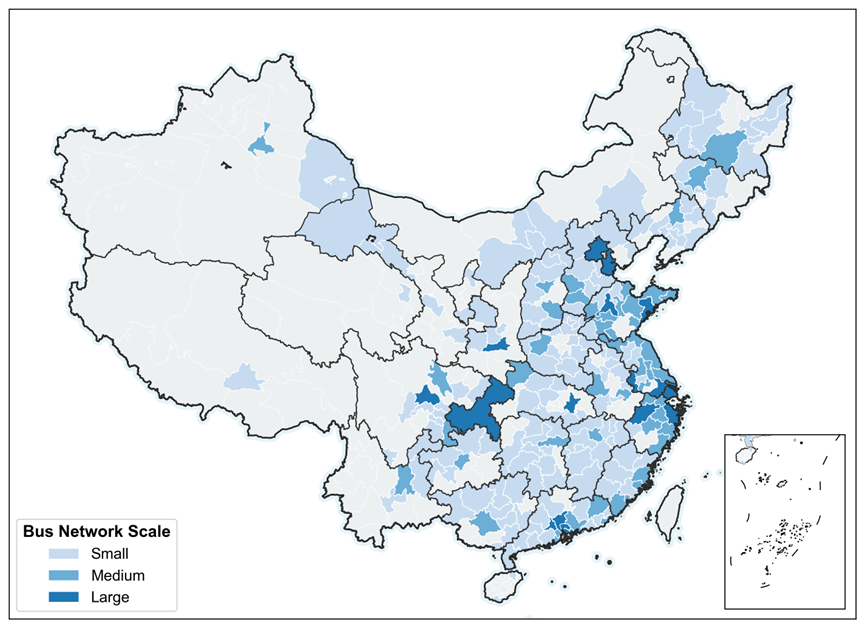
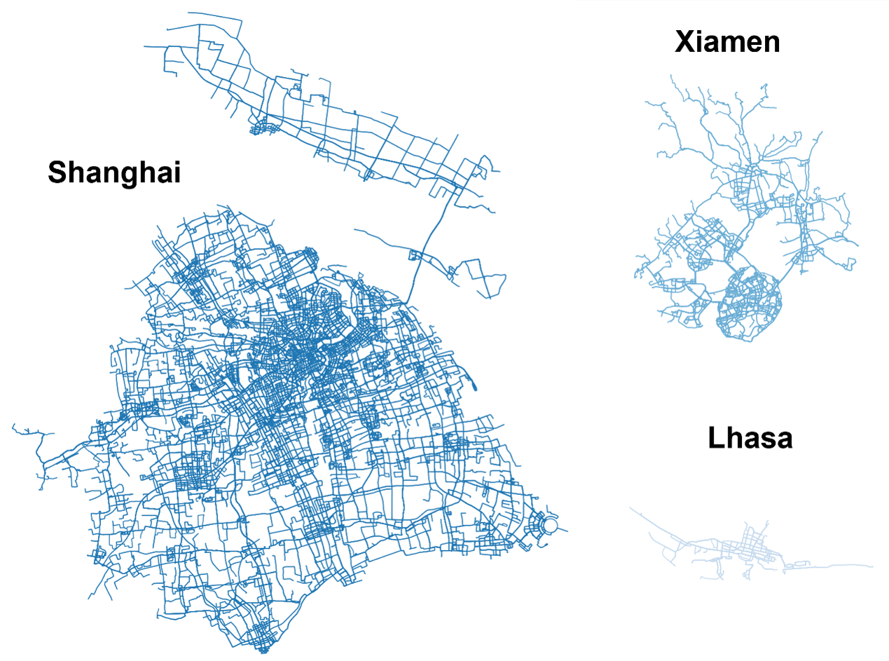

# Bus Operation Data in 224 Chinese Cities 

> Posted on 8 July 2026 by Ding CHEN

We are pleased to share a new bus operation dataset in 2025 covering 224 cities in China. The dataset includes bus routes and stops, one-day bus operational data, and road network. An interactive map can be found [here](https://globalevdata.github.io/ChinaEBus/map/china-city.html) to visualize the bus operation within each of the cities. You may apply for the dataset through our Global EV Data Initiative by clicking [here](https://globalevdata.github.io/ApplicationForm.html).

> *224 Chinese Cities Grouped by Bus Network Length*

> *Three sample cities: Shanghai, Xiamen, Lhasa*